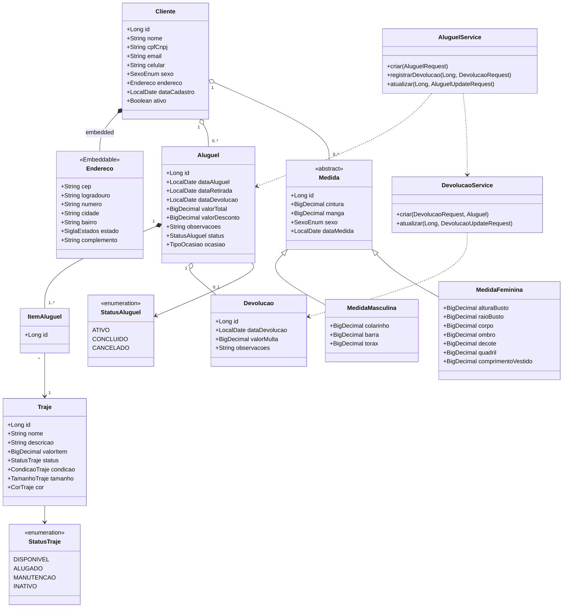

# Diagrama de classes

Domínio JPA e serviços principais do agregado de aluguel.

```mermaid
classDiagram
    direction TB

    class Cliente {
        +Long id
        +String nome
        +String cpfCnpj
        +String email
        +String celular
        +SexoEnum sexo
        +Endereco endereco
        +LocalDate dataCadastro
        +Boolean ativo
    }

    class Endereco {
        <<Embeddable>>
        +String cep
        +String logradouro
        +String numero
        +String cidade
        +String bairro
        +SiglaEstados estado
        +String complemento
    }

    class Aluguel {
        +Long id
        +LocalDate dataAluguel
        +LocalDate dataRetirada
        +LocalDate dataDevolucao
        +BigDecimal valorTotal
        +BigDecimal valorDesconto
        +String observacoes
        +StatusAluguel status
        +TipoOcasiao ocasiao
    }

    class ItemAluguel {
        +Long id
    }

    class Traje {
        +Long id
        +String nome
        +String descricao
        +BigDecimal valorItem
        +StatusTraje status
        +CondicaoTraje condicao
        +TamanhoTraje tamanho
        +CorTraje cor
    }

    class Devolucao {
        +Long id
        +LocalDate dataDevolucao
        +BigDecimal valorMulta
        +String observacoes
    }

    class Medida {
        <<abstract>>
        +Long id
        +BigDecimal cintura
        +BigDecimal manga
        +SexoEnum sexo
        +LocalDate dataMedida
    }

    class MedidaMasculina {
        +BigDecimal colarinho
        +BigDecimal barra
        +BigDecimal torax
    }

    class MedidaFeminina {
        +BigDecimal alturaBusto
        +BigDecimal raioBusto
        +BigDecimal corpo
        +BigDecimal ombro
        +BigDecimal decote
        +BigDecimal quadril
        +BigDecimal comprimentoVestido
    }

    class AluguelService {
        +criar(AluguelRequest)
        +registrarDevolucao(Long, DevolucaoRequest)
        +atualizar(Long, AluguelUpdateRequest)
    }

    class DevolucaoService {
        +criar(DevolucaoRequest, Aluguel)
        +atualizar(Long, DevolucaoUpdateRequest)
    }

    class StatusAluguel {
        <<enumeration>>
        ATIVO
        CONCLUIDO
        CANCELADO
    }

    class StatusTraje {
        <<enumeration>>
        DISPONIVEL
        ALUGADO
        MANUTENCAO
        INATIVO
    }

    Cliente *-- Endereco : embedded
    Cliente "1" o-- "0..*" Aluguel
    Cliente "1" o-- "0..*" Medida
    Aluguel "1" *-- "1..*" ItemAluguel
    Aluguel "1" o-- "0..1" Devolucao
    ItemAluguel "*" --> "1" Traje
    Medida <|-- MedidaMasculina
    Medida <|-- MedidaFeminina
    Aluguel --> StatusAluguel
    Traje --> StatusTraje
    AluguelService ..> Aluguel
    AluguelService ..> DevolucaoService
    DevolucaoService ..> Devolucao
```
