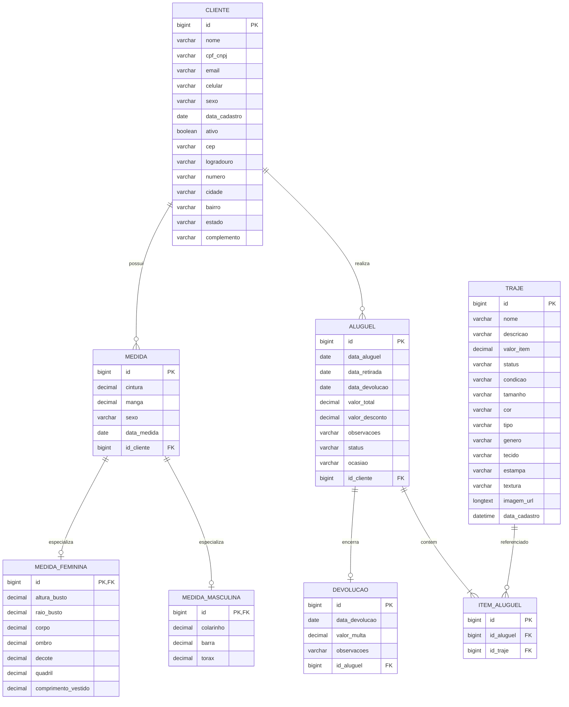

# Diagrama entidade-relacionamento (ER)

Modelo lógico do banco MySQL, conforme mapeamento JPA (`ddl-auto: update`).

- **Endereço:** colunas embutidas na tabela `cliente` (`@Embedded` em `Cliente`).
- **Medida:** herança `JOINED` — tabela base `medida` + `medida_masculina` / `medida_feminina`.

