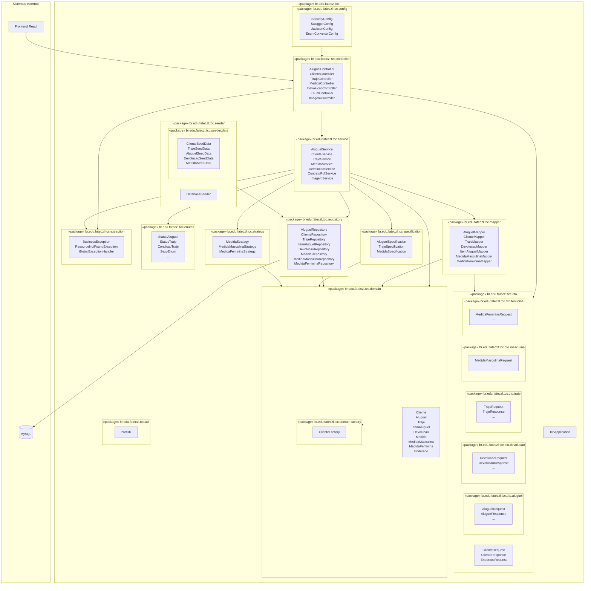

# Diagrama de pacotes

Backend Spring Boot — locadora de trajes a rigor (`br.edu.fateczl.tcc`).

**Regra de dependência:** `controller → service → repository → domain`. DTOs e mappers ficam na borda HTTP; entidades JPA não são expostas nos endpoints.

