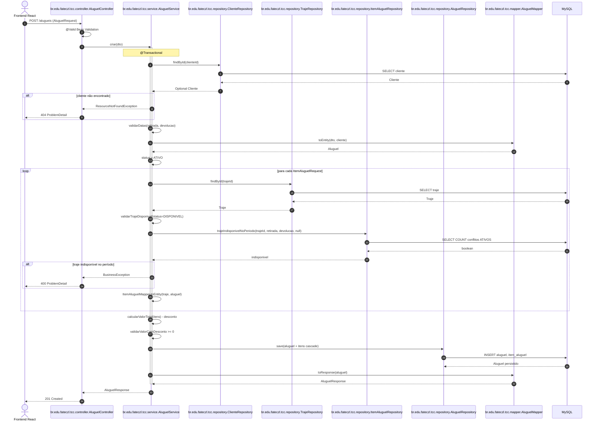

# Diagrama de sequência — criação de aluguel

Fluxo feliz de `POST /alugueis`, do Frontend React até a persistência em MySQL.

| Etapa | Responsável |
|-------|-------------|
| Validação HTTP | `br.edu.fateczl.tcc.controller.AluguelController` |
| Regras de negócio | `br.edu.fateczl.tcc.service.AluguelService` |
| Conflito de período | `br.edu.fateczl.tcc.repository.ItemAluguelRepository.trajeIndisponivelNoPeriodo` |
| Status inicial | `StatusAluguel.ATIVO` |

