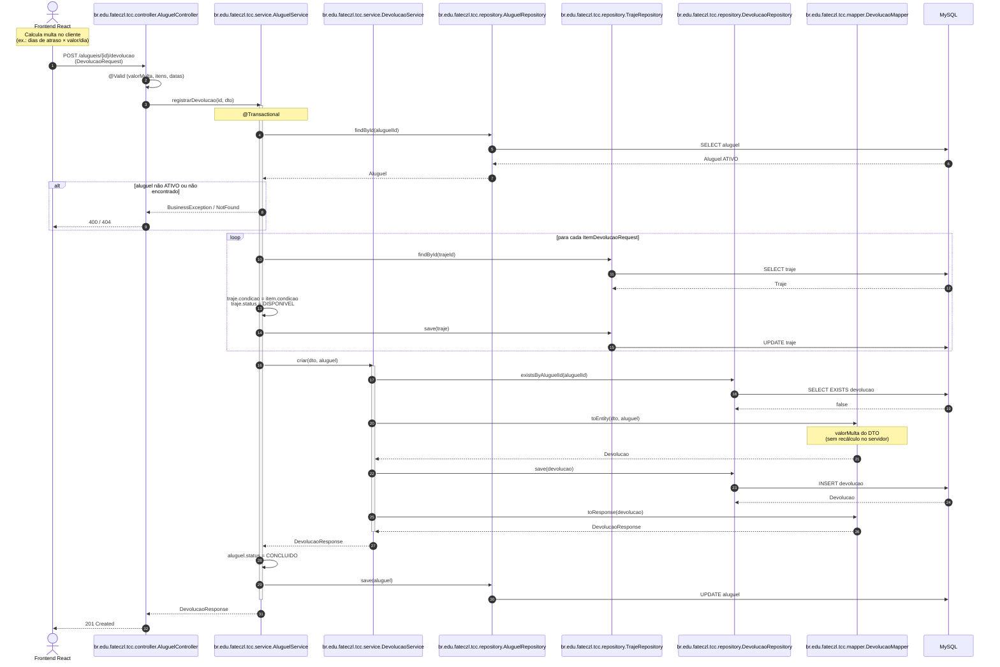

# Diagrama de sequência — devolução com cálculo de multa

Fluxo de `POST /alugueis/{id}/devolucao`.

A **multa** (`valorMulta`) é calculada no **Frontend React** e enviada no `DevolucaoRequest`. O backend valida (`@PositiveOrZero`, `@Digits`), persiste via `DevolucaoMapper` e altera o aluguel para `StatusAluguel.CONCLUIDO`.

